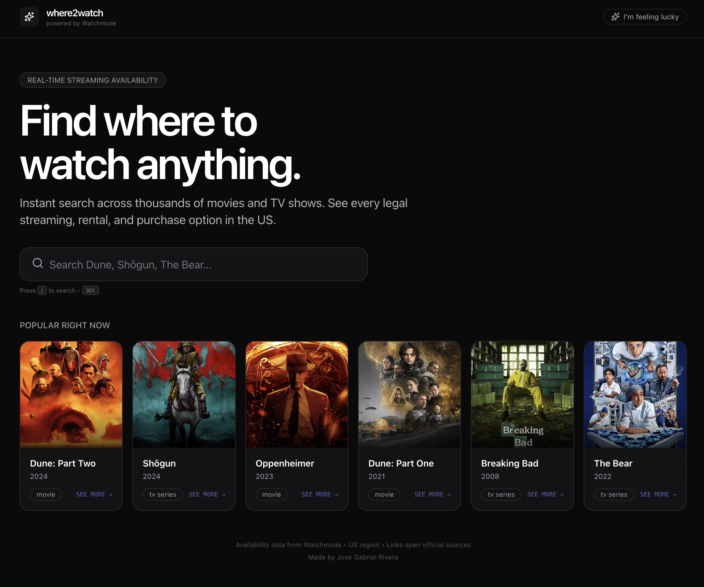

# where2watch

A beautiful, fast, cinematic web app to instantly find where to stream, rent, or buy any movie or TV show — powered by the [Watchmode API](https://api.watchmode.com/).



## About

**where2watch** is a modern, visually polished web application that helps you quickly discover where to legally watch movies and TV shows. It provides real-time streaming availability across major platforms including Netflix, Hulu, Max, Prime Video, Disney+, Peacock, and more.

Built with Next.js 16 and designed with a cinematic dark interface, the app features:

- Instant search with live results
- High-quality posters for popular titles
- A rich detail modal showing plot summaries, ratings, genres, and clearly organized options for **subscription streaming**, **free/ad-supported viewing**, **rentals**, and **purchases**

The project emphasizes excellent user experience, performance, and security — your Watchmode API key is never exposed to the client. It is fully responsive and works great on both desktop and mobile.

This was built as a personal project to explore clean frontend architecture, API integration, and delightful UI/UX patterns.

## ✨ Features

- **Instant search** — live results as you type (debounced)
- **Curated popular grid** — 6 excellent titles ready on first load (zero API calls)
- **Rich detail modal** — plot, ratings, genres + every legal option grouped (Subscription / Free / Rent / Buy)
- **Beautiful provider logos** — pulled live from Watchmode’s CDN
- **Direct links** — every “Watch” button opens the official source in a new tab
- **Keyboard friendly** — press `/` or `⌘K` to search, `Esc` to close
- **“I’m feeling lucky”** — one click opens a random popular title
- **Mobile first** — gorgeous on phones and tablets
- **100% server-safe** — your Watchmode API key never leaves the server

## 🚀 Deploy to Vercel (Recommended)

The fastest way to get your own live copy:

[](https://vercel.com/new/clone?repository-url=https%3A%2F%2Fgithub.com%2Fyour-username%2Fwhere-to-watch)

### Manual Deploy Steps

1. **Push this repo** to your own GitHub account (or use the button above).
2. Go to [vercel.com/new](https://vercel.com/new) and import the repository.
3. **Critical**: In the Vercel dashboard, go to your new project → **Settings → Environment Variables** and add:
   - `WATCHMODE_API_KEY` = your real key (from https://api.watchmode.com/)
4. Redeploy. Done.

Your site will be live at `your-project.vercel.app` in ~30 seconds.

## 🛠 Local Development

```bash
# 1. Clone
git clone <your-repo>
cd where-to-watch

# 2. Install
npm install

# 3. Add your key
cp .env.example .env.local
# Edit .env.local and paste your Watchmode key

# 4. Run
npm run dev
```

Open http://localhost:3000

## 🔑 Getting a Watchmode API Key

1. Go to https://api.watchmode.com/
2. Sign up (free)
3. Copy your key
4. Paste it into `.env.local` (or Vercel env vars)

Free tier = 1,000 requests/day — plenty for personal use and small projects.

## 🧱 Tech Stack

- Next.js 16 (App Router) + TypeScript
- Tailwind CSS + Framer Motion
- Zero external state management
- Server-side API proxy (key never exposed)
- Deployed on Vercel

## 📁 Project Structure

```
app/
  api/
    search/          # Live title search proxy
    details/[id]/    # Full metadata + sources
    sources/         # Provider logos (cached 24h)
  page.tsx           # The entire experience
components/
  MovieCard.tsx
  DetailModal.tsx    # The beautiful rich modal
  SearchBar.tsx
  SourcePill.tsx
lib/
  types.ts
  utils.ts
```

## 🛡️ Security & Limits

- API key lives only in serverless functions
- All source links are the official ones returned by Watchmode
- US region focused (easy to extend to other countries)

## 🙏 Credits

- Data provided by [Watchmode](https://api.watchmode.com/)
- Built with ❤️ and a love for great movie nights

---

**Made for you.** Change the name, colors, or add more regions — the codebase is intentionally small and easy to hack on.

Enjoy finding your next watch. 🎬
